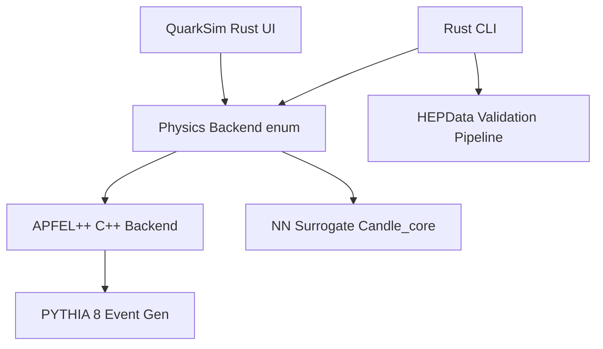

# QuarkSim: Inclusive DIS, Theory Uncertainties, and Surrogate ML

QuarkSim is an advanced command-line and graphical application for simulating inclusive Deep Inelastic Scattering (DIS), computing fully reproducible NLO theoretical predictions, and visualizing results. It leverages `APFEL++` for DGLAP evolution, `PYTHIA 8` for event generation, and `LHAPDF` for partonic densities, alongside an optional Neural Network Surrogate backend for extremely fast $x-Q^2$ interpolation.

It strictly separates the scientific physics framework from a legacy educational demonstration of the Cornell potential.

## 🏗️ Architecture



## 🚀 Installation

### Option A: WSL 2 (Native Development)
Run all Cargo commands from the `quark_sim` directory within WSL Ubuntu.

1. **Setup dependencies**:
```bash
./scripts/setup_all_wsl.sh
```
This script downloads and installs LHAPDF, HepMC3, Pythia 8, and APFEL++.

2. **Activate the environment**:
```bash
source scripts/apfelxx_env.sh
```

3. **Build and Run**:
```bash
cargo build --release
```

### Option B: Docker (Clean-Room Reproducibility)
QuarkSim ships with a multi-stage `Dockerfile` capturing the entire environment in a container.
```bash
./docker/build.sh
./docker/run.sh
```

## 🔬 Quick Start & Examples

### 1. HERA Validation Example
Validates predictions against real, combined HERA experimental data, computing $\chi^2$, data/theory ratios, and residuals.
```bash
cargo run --release -- validate-hera --q2-min 3.5 --output-dir outputs/hera_validation
```

### 2. Systematic Theory Uncertainties
Calculates and plots the 7-point $\mu_R, \mu_F$ scale variations and asymmetric LHAPDF eigenvector uncertainties.
```bash
cargo run --release -- theory-uncertainties --q2-min 3.5 --output-dir outputs/theory_bands
```

### 3. DIS Structure Function Evaluation
Evaluate $F_2$, $F_L$, and $xF_3$ directly at an $(x, Q^2)$ point via `APFEL++`.
```bash
cargo run --release -- structure-functions --backend apfel --x 0.01 --q2 100 --order NLO --pdf-set CT18NLO
```

### 4. DIS Event Generation
Generate DIS events mediated by PYTHIA 8, tracking the full output via HepMC3 format.
```bash
cargo run --release -- generate-events --electron-energy 27.5 --proton-energy 920.0 --events 100
```

### 5. Launch GUI
```bash
cargo run --release
```
Select "DIS Analysis" to enter the scientific UI.

## 🧠 Scientific Limitations
QuarkSim is designed for rigorous DIS validation at intermediate-to-high $Q^2$, but contains deliberate approximations:
- Calculates up to NLO; missing NNLO terms.
- Pure QCD virtual-photon exchange; $Z$-boson and $\gamma Z$ interference electroweak corrections are omitted.
- Utilizes ZMVFNS (massless heavy quarks) leading to deviations near the charm threshold.
- PYTHIA 8 provides purely phenomenological hadronization; **no GEANT4 detector simulation is included.**
- See [docs/scientific_scope_and_limitations.md](docs/scientific_scope_and_limitations.md) for the complete scientific audit.

## 🔒 Reproducibility Guarantee
Every physics calculation and generated file injects a robust reproducibility metadata JSON footprint, tracking:
- Target architecture and OS
- Rustc toolchain version
- Exact `APFEL++`, `LHAPDF`, `PYTHIA 8`, and `HepMC3` versions
- Git Hash and Dirty working-tree status
- Exact analytical physics configuration (Scales, Orders, Schemes)

## 🧪 Testing
We maintain rigorous deterministic CI regression testing:
```bash
cargo test
cargo clippy -- -D warnings
cargo fmt -- --check
```

## 📚 Legacy Educational Mode
QuarkSim retains its original legacy demonstration visualizing simulated electron trajectories within the Cornell strong-force potential via an explicit `egui` state machine split. This is solely an educational tool and does not represent physical DIS cross-sections. Do not conflate the "Cornell Demo" tab with the "DIS Analysis" tab.
